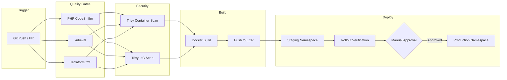

# CI/CD Pipeline – WordPress on AWS EKS

## End-to-End Pipeline: Dev to Production

The pipeline follows a **GitOps-inspired** approach where all changes flow through Git. Developers work on feature branches, create Pull Requests to `main`, and the pipeline automates quality checks, security scanning, containerization, and deployment across environments.

### Flow

1. **Developer pushes code** to a feature branch and opens a Pull Request against `main`.
2. **Lint & Quality stage** runs automatically: PHP CodeSniffer validates WordPress coding standards, `kubeval` validates Kubernetes manifests, and `terraform fmt` checks Terraform formatting.
3. **Security stage**: Trivy scans the Docker image for CVEs (Critical/High severity) and the Terraform code for misconfigurations.
4. **On merge to `main`**, the Build stage creates the Docker image, tags it with the commit SHA for traceability, and pushes it to Amazon ECR.
5. **Staging deployment** automatically applies the K8s manifests to the `staging` namespace on EKS, waits for a successful rollout, and verifies pod health.
6. **Production deployment** requires **manual approval** via GitHub Environments. After a reviewer approves, the same verified image is deployed to the `production` namespace.

This ensures that every image deployed to production has passed lint checks, security scans, and a full staging validation.

---

## Recommended Tools

| Category | Tool | Rationale |
|---|---|---|
| **CI/CD Platform** | GitHub Actions | Native integration with GitHub, free for public repos, rich marketplace |
| **Container Registry** | Amazon ECR | Native AWS integration, lifecycle policies, image scanning |
| **Container Scanning** | Trivy | Open-source, fast, detects OS & app vulnerabilities |
| **IaC Scanning** | Trivy (config mode) | Same tool for container + IaC scans, reduces toolchain complexity |
| **Linting (PHP)** | PHP CodeSniffer | WordPress-specific ruleset available |
| **K8s Validation** | kubeval | Validates manifests against K8s OpenAPI schemas |
| **IaC** | Terraform | Declarative, AWS-native provider, reusable modules |
| **Orchestration** | Amazon EKS | Managed Kubernetes, integrates with AWS IAM, autoscaling |

### Key CI/CD Cycle Steps

1. **Source** → Git push / PR triggers pipeline
2. **Lint** → Static analysis (PHP, Terraform, K8s YAML)
3. **Test** → Unit/integration tests (extensible for WordPress themes/plugins)
4. **Security** → Container vulnerability scan + IaC misconfiguration scan
5. **Build** → Docker image creation + push to ECR
6. **Deploy (Staging)** → Automated deployment + rollout verification
7. **Deploy (Production)** → Manual gate + deployment + health check

---

## Code Quality & Security in the Pipeline

**Code Quality** is enforced at the earliest stage to provide fast feedback:
- **PHP CodeSniffer** with WordPress standards catches coding standard violations before they reach the container.
- **Terraform `fmt`** ensures consistent infrastructure code formatting.
- **kubeval** validates K8s manifests are syntactically correct and compatible with the target cluster version.
- Future extensions: SonarQube or SonarCloud for deeper static analysis, code coverage thresholds, and technical debt tracking.

**Security** is integrated as a gate before the build reaches any environment:
- **Trivy container scan** blocks the pipeline on CRITICAL/HIGH CVEs in the Docker image (OS packages and application dependencies).
- **Trivy IaC scan** checks Terraform code for security misconfigurations (open security groups, missing encryption, public resources).
- **ECR scan-on-push** provides a secondary layer of image scanning in the registry itself.
- Future extensions: OWASP ZAP for DAST (dynamic application security testing) against the staging environment, Snyk for dependency monitoring, and AWS GuardDuty for runtime threat detection.

---

## Pipeline Diagram

---

## GitHub Secrets Required

| Secret | Description |
|---|---|
| `AWS_ACCESS_KEY_ID` | AWS IAM access key for ECR and EKS |
| `AWS_SECRET_ACCESS_KEY` | AWS IAM secret key |
| `ECR_URL` | Full ECR repository URL (e.g., `123456789.dkr.ecr.eu-west-3.amazonaws.com/mi-ecr-de-prueba`) |

## GitHub Environments Required

| Environment | Protection Rules |
|---|---|
| `staging` | None (auto-deploy) |
| `production` | Required reviewers (at least 1 approver) |
